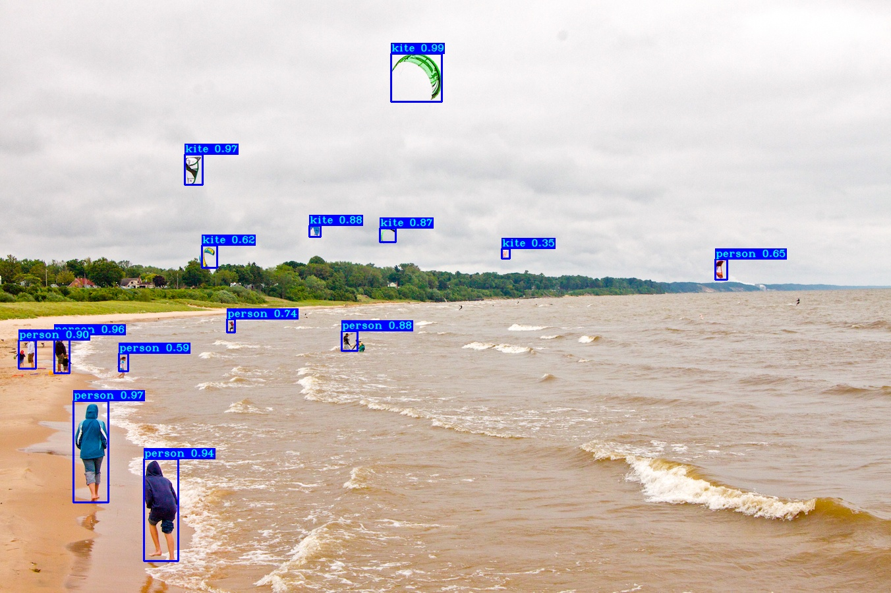
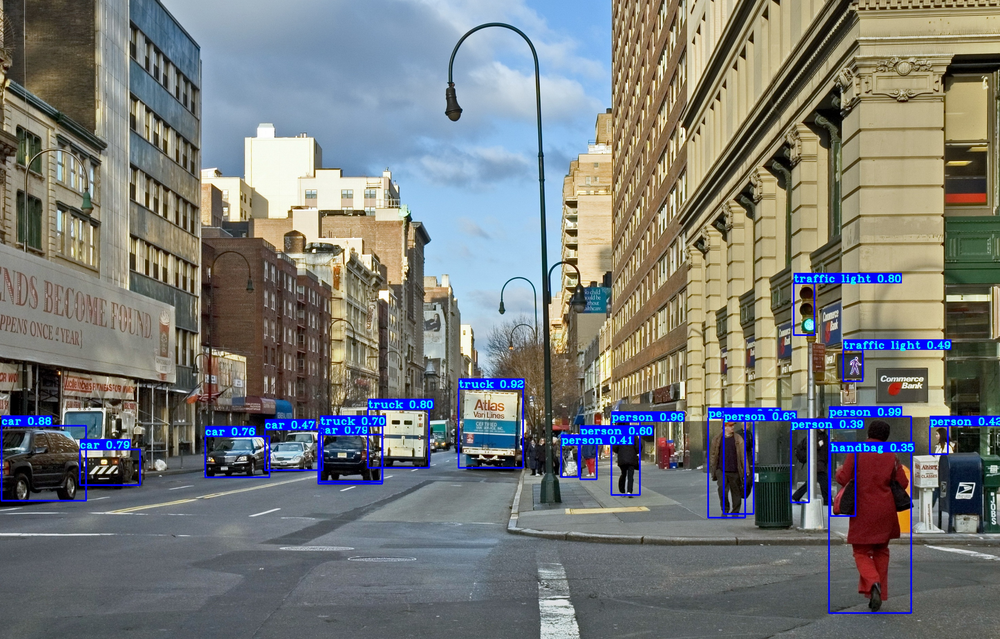

# TF2.0 Yolov3 Yolov4 : image

YOLOv3 and YOLOv4 implementation in TensorFlow 2.x, with support for training, transfer training, object tracking mAP and so on...
Code was tested with following specs:
- Code was tested on Windows 10


### 0.1. Demonstration 1



### 0.2. Demonstration 2



### 0.3. Demonstration 3


## 1. Installation
First, clone or download this GitHub repository.
Install requirements and download from official darknet weights:
```
# yolov3
wget -P model_data https://pjreddie.com/media/files/yolov3.weights

# yolov3-tiny
wget -P model_data https://pjreddie.com/media/files/yolov3-tiny.weights

# yolov4
wget -P model_data https://github.com/AlexeyAB/darknet/releases/download/darknet_yolo_v3_optimal/yolov4.weights

# yolov4-tiny
wget -P model_data https://github.com/AlexeyAB/darknet/releases/download/darknet_yolo_v4_pre/yolov4-tiny.weights
```

Or you can download darknet weights from my google drive:

https://drive.google.com/drive/folders/1w4KNO2jIlkyzQgUkkcZ18zrC8A1Nqvwa?usp=sharing

## 2. Pretrained weights

You can download pretrained weights from my google drive:

https://drive.google.com/drive/folders/1ot7xb7mxwZZfgMn2F4JwXDM8wWb08Kvg?usp=sharing

I uploaded weigts for the below models
- [x] yolo_v3_coco
- [x] yolo_v3_coco_tiny
- [x] yolo_v3_fashion_mnist
- [x] yolo_v3_fashion_mnist_tiny
- [x] yolo_v3_mnist
- [x] yolo_v3_mnist_tiny
- [x] yolo_v3_voc
- [x] yolo_v3_voc_tiny
- [x] yolo_v4_coco
- [x] yolo_v4_coco_tiny
- [x] yolo_v4_fashion_mnist
- [x] yolo_v4_fashion_mnist_tiny
- [x] yolo_v4_mnist
- [x] yolo_v4_mnist_tiny
- [x] yolo_v4_voc
- [x] yolo_v4_voc_tiny

## 3. Datasets

You can download darknet weights from my google drive:

https://drive.google.com/file/d/1yTxaODCNp-x_tlS8Jwox0BwcXV-JCmNG/view?usp=sharing

Please build the 'Folder Structure' like below.

```
${ROOT}
├── dataset/ 
│   ├── coco/
│   │    ├── folders/
│   │    └── files
│   ├── fashion_mnist/
│   │    ├── folders/
│   │    └── files
│   ├── mnist/
│   │    ├── folders/
│   │    └── files
│   ├── voc/
│   │    ├── folders/
│   │    └── files
│   └── coco.names
```

## 4. Quick start
Start with using pretrained weights to test predictions on both image and video:

### 4.1. minst:
- Download `pretrained weights` from links above;
- In `configuration.py` script choose your `dataset_name = "mnist"`;
- In `configuration.py` script choose your `YOLO_TYPE` as `yolov4` or `yolov3`;
- In `configuration.py` script choose your `TRAIN_YOLO_TINY`, if you choose `True`, this model will generate `tiny yolo model`;
- In `configuration.py` script choose your `YOLO_CUSTOM_WEIGHTS` as `True`;

```
    $ python detect_mnist.py
    $ python evaluate_mAP.py
    $ python train.py
```

### 4.2. fashion mnist:
- Download `pretrained weights` from links above;
- In `configuration.py` script choose your `dataset_name = "fashion_mnist"`;
- In `configuration.py` script choose your `YOLO_TYPE` as `yolov4` or `yolov3`;
- In `configuration.py` script choose your `TRAIN_YOLO_TINY`, if you choose `True`, this model will generate `tiny yolo model`;
- In `configuration.py` script choose your `YOLO_CUSTOM_WEIGHTS` as `True`;

```
    $ python detect_mnist.py
    $ python evaluate_mAP.py
    $ python train.py
```

### 4.3. voc:
- Download `pretrained weights` from links above;
- In `configuration.py` script choose your `dataset_name = "voc"`;
- In `configuration.py` script choose your `YOLO_TYPE` as `yolov4` or `yolov3`;
- In `configuration.py` script choose your `TRAIN_YOLO_TINY`, if you choose `True`, this model will generate `tiny yolo model`;
- In `configuration.py` script choose your `YOLO_CUSTOM_WEIGHTS` as `True`;

```
    $ python detect_image.py
    $ python detect_video.py
    $ python detect_webcam.py
    $ python evaluate_mAP.py
    $ python train.py
```

### 4.4. coco:
- Download `pretrained weights` from links above;
- In `configuration.py` script choose your `dataset_name = "coco"`;
- In `configuration.py` script choose your `YOLO_TYPE` as `yolov4` or `yolov3`;
- In `configuration.py` script choose your `TRAIN_YOLO_TINY`, if you choose `True`, this model will generate `tiny yolo model`;
- In `configuration.py` script choose your `YOLO_CUSTOM_WEIGHTS` as `True`;

```
    $ python detect_image.py
    $ python detect_video.py
    $ python detect_webcam.py
    $ python evaluate_mAP.py
    $ python train.py
```

## Folder structure

```
${ROOT}
├── configuration.py
├── detect_mnist.py
├── detect_image.py
├── detect_mnist.py
├── detect_video.py
├── detect_webcam.py
├── evaluate_mAP.py
├── README.md 
├── train.py
├── asset/ 
│   ├── Pred_kite.jpg
│   ├── Pred_city.jpg
│   └── pred_street.gif
├── checkpoints/ 
│   ├── yolo_v3_coco/
│   │    ├── checkpoint
│   │    ├── yolo_v3_coco.data-00000-of-00001
│   │    └── yolo_v3_coco.index
│   ├── yolo_v3_coco_tiny/
│   ├── yolo_v3_fashion_mnist/
│   ├── yolo_v3_fashion_mnist_tiny/
│   ├── yolo_v3_mnist/
│   ├── yolo_v3_mnist_tiny/
│   ├── yolo_v3_voc/
│   ├── yolo_v3_voc_tiny/
│   ├── yolo_v4_coco/
│   ├── yolo_v4_coco_tiny/
│   ├── yolo_v4_fashion_mnist/
│   ├── yolo_v4_fashion_mnist_tiny/
│   ├── yolo_v4_mnist/
│   ├── yolo_v4_mnist_tiny/
│   ├── yolo_v4_voc/
│   └── yolo_v4_voc_tiny/
├── darknet_weights/ 
│   ├── yolov3.weights
│   ├── yolov3-tiny.weights
│   ├── yolov4.weights
│   └── yolov4-tiny.weights
├── dataset/ 
│   ├── coco/
│   │    ├── folders/
│   │    └── files
│   ├── fashion_mnist/
│   ├── mnist/
│   ├── voc/
│   └── coco.names
├── IMAGES/
│   ├── city.jpg
│   ├── dog.jpg
│   ├── kite.jpg
│   ├── street.jpg
│   ├── Highway.mp4
│   ├── shinjuku.mp4
│   └── street.mp4
├── log/
├── mAP/
├── pred_IMAGES/
└── yolo_core/
    ├── backbone.py
    ├── common.py
    ├── dataset.py
    ├── models.py
    ├── utils.py
    └── yolov3.py
```

